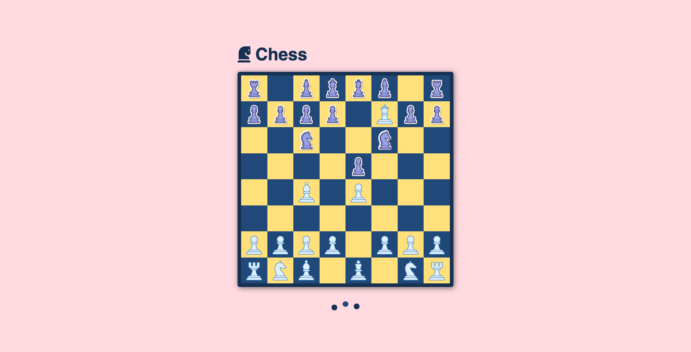

# Grid Chessboard

I built a chessboard using grid.

### Update

- Added CSS animations for the chess pieces.
- Added loading animation.

## Tech Stack

- HTML
- CSS
- Sass

## Live Demo

Github Page (https://grenzk.github.io/grid-chessboard/)

## Source

Avion School (https://docs.avionschool.com/avn-mcourse/-MYjabeTubdULkJ4UAcG/lessons/project-chessboard)
